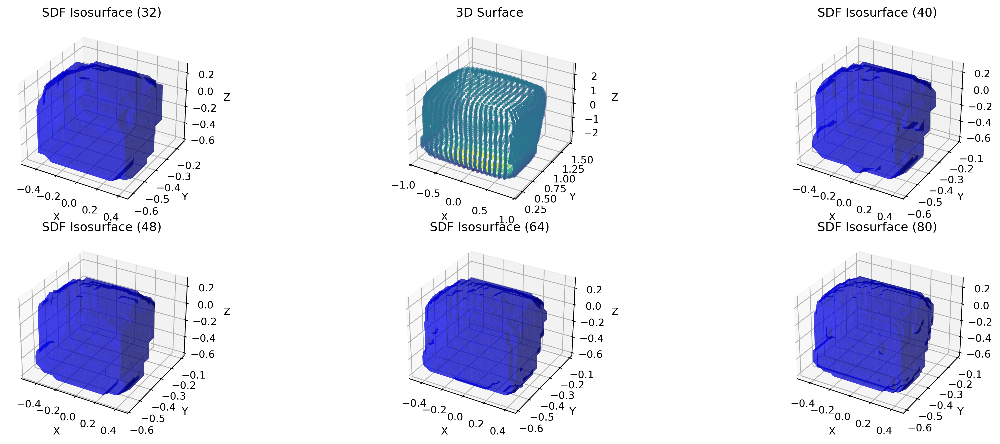
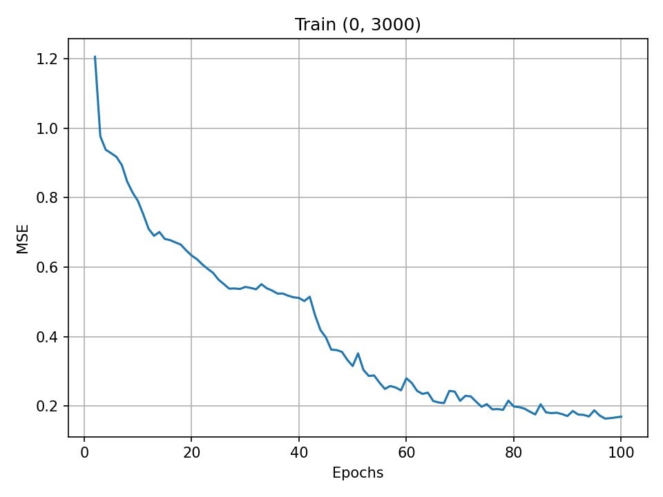
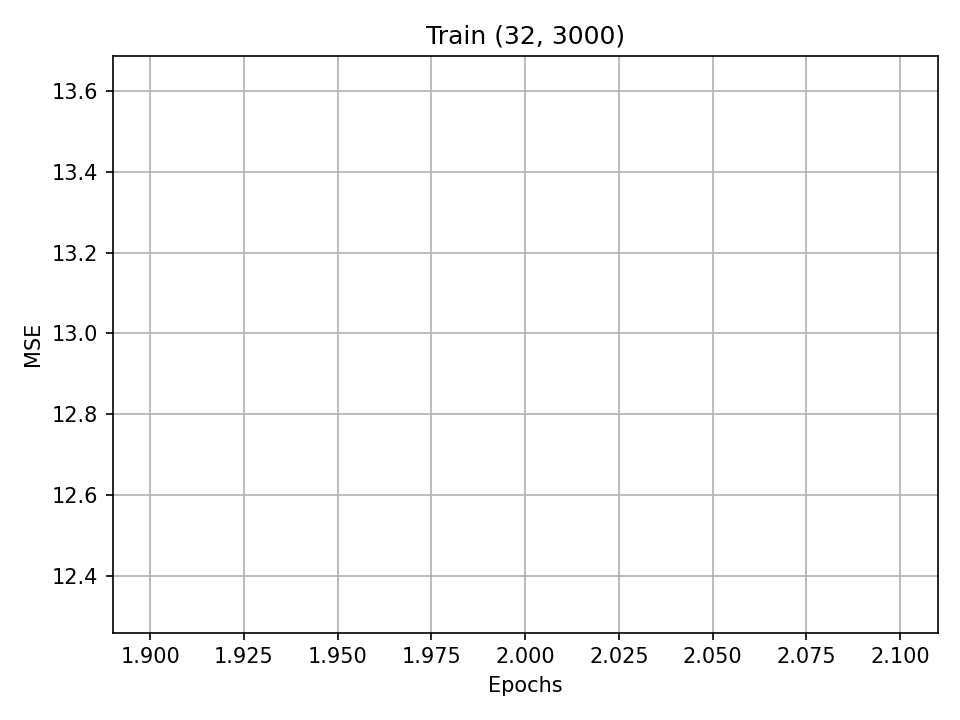
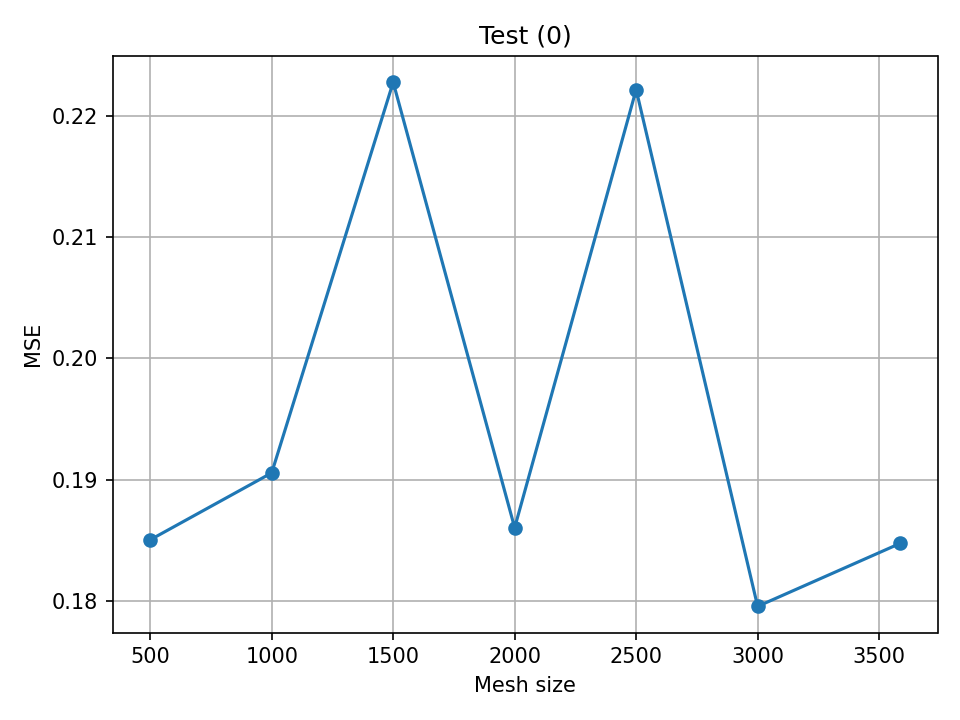

# Pressure regression with Universal Physics Transformer (UPT)
**Student:** Luca Frattegiani (lfratteg@sissa.it)

## General Description
UPT (https://arxiv.org/abs/2402.12365) is a transformer-based architecture able to perform neural operator learning in the context of a given spatio-temporal problem. In this project I tried to replicate the particular UPT structure used for steady state flows prediction, training and testing the model on the ShapeNet-Car dataset (https://visualcomputing.ist.ac.at/publications/2018/LearningFlow/).

## Dataset
Data are represented by a collection of $889$ cars which surfaces consist of $3586$ mesh points in $\mathbb{R}^3$. For each spatial location, $10s$ of air flow have been simulated and after averaging results for the last $4s$, a pressure value is associated to any mesh point. 

Additionally, any car has been mapped to a $R \times R \times R$ dimensional tensor (with $R \in \{32, 40, 48, 64, 80\}$) providing the SDF values of the car.



## Results
Models have been trained following as much as possible the hyperparameterization specified in the original UPT paper both including and not including the additional information provided by the SDF surface. Multiple runs have been done to test performances for different mesh sizes in the set $\{500, 1000, 1500, 2000, 2500, 3000, 3586\}$

Below is reported the training loss evolution over epochs for two training procedures having identical mesh sizes but the first one doesn't include SDF information while the second one uses the $R = 32$ resolution:

 


Regarding the test loss, here I show values obtained for different mesh sizes:



## Environment setting and data importation

### Training on GPU
To set up a correct environment for the package the following actions from terminal are required:

```bash
# Create and activate env
conda env create -name myenv python=3.11
conda activate myenv
```

Then from the project root, after having cloned the repository one has to run:

```bash
python -m pip install -r requirements.txt
```

If one wants to use GPU to run the model, the correct version of PyTorch has to be installed, so the following command in addition is required:

```bash
python -m pip install torch torchvision --index-url https://download.pytorch.org/whl/cu126
```

### Download and preprocess data
From the root of the cloned repository run that command from terminal in order to download -> preprocess data and put them in the ```bash data/``` directory:

```bash
sh shell/download.sh
``` 